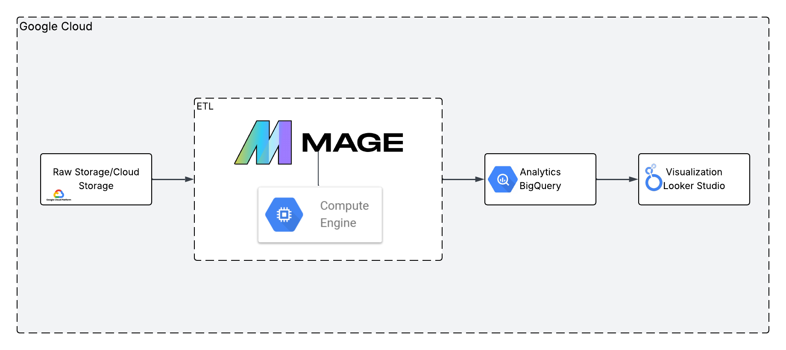
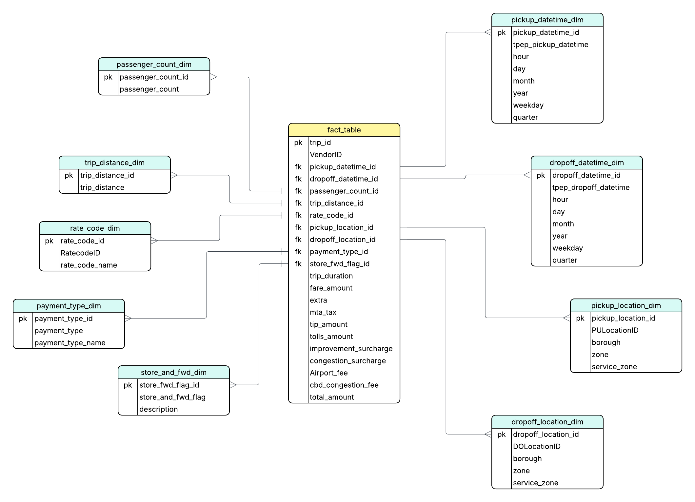
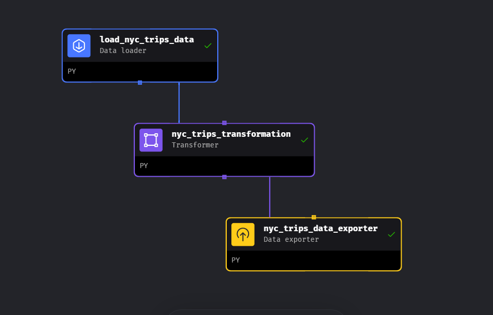

# NYC-Trips-DataEngineering-Project

## Overview
An end-to-end data engineering project on NYC Yellow Taxi Trip data (January 2025) — from raw data ingestion to an interactive dashboard on Google Cloud Platform.

## Architecture

## Technology Used
- **Python**
- **Google Cloud Storage** — raw data lake
- **Compute Engine** — VM to host Mage AI
- **Mage AI** — ETL pipeline
- **BigQuery** — data warehouse
- **Looker Studio** — dashboard

## Dataset
NYC TLC Yellow Taxi Trip Records (January 2025)
- **Download:** https://storage.googleapis.com/nyc-trips-de-project-bucket/yellow_tripdata_2025-01.parquet
- **More info:** https://www.nyc.gov/site/tlc/about/tlc-trip-record-data.page

## Data Model

## Mage Pipeline

## Dashboard
🔗 [NYC Trips Analytics Dashboard](https://lookerstudio.google.com/reporting/3f4d17f6-8242-442f-93b0-210b3587b3f2/page/YXSuF)
